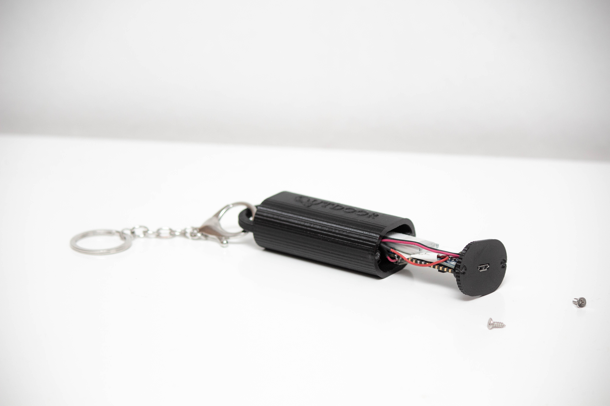

# Keychain WiFi Tracker

**Outdoor** is a device designed to track the time spent outside by elderly people. It's built on the Arduino Nano 33 IoT board, a low-power Arduino board with an integrated WiFi chip. The Arduino is integrated in a keychain with a rechargeable battery. A charging station has also been developed and an accompanying Android app to track the gathered data was developed separately.

## Description
This project was part of the 4WBB0 Engineering Design course at the Eindhoven University of Technology. It covers the embedded software part of the project. The goal of the project was to develop a prototype of a device that could tackle any problem elderly people at home might have. The device that was developed is aimed towards combatting lonely or inactive elders, by tracking the amount of time that they spend outside. This is done by calculating the duration that a WiFi enabled keychain is connected to the home WiFi. The device connects to an online database, Firebase, to store the gathered data. This enables the caretaker to review the data remotely via an Android app.

## Installation
1. Clone this repository.
2. Install the required Arduino libraries:
   - `Firebase_Arduino_WiFiNINA`
   - `RTCZero`
3. Adjust the paramters in the code `wifi_detection.ino`.
4. Create a separate `secrets.h` file in which password variables can be stored separately.
5. Open the Arduino IDE and upload the customized code to your Arduino Nano 33 IoT board.

## Usage
1. Ensure your Arduino is connected and powered on.
2. The device will automatically track the time spent outdoors by detecting WiFi disconnection.
3. Data will be stored in Firebase, and you can retrieve it for further analysis or display.

## Contributing
If you'd like to contribute, please fork the repository and use a feature branch. This project is not maintained.

## License
This project is licensed under the MIT License - see the [LICENSE.md](LICENSE.md) file for details.

## Acknowledgments
- Code was written by Lionnus Kesting with the help of various libraries and online repositories.
- Thanks to the rest of the project team for the development of the app.
